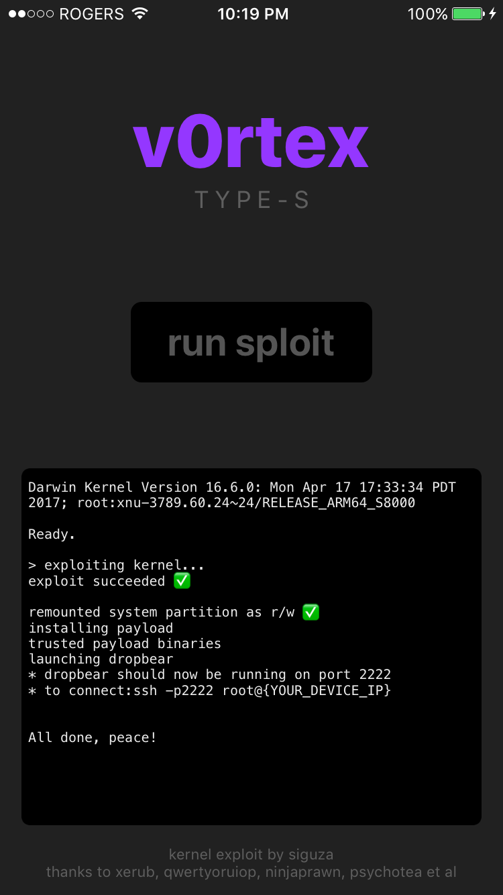

# v0rtex type-S 

A simple iOS app (including Xcode project) that can be used for testing Siguza's [v0rtex](https://github.com/Siguza/v0rtex) kernel exploit. Implements some post-exploit "kppless" fun, leading to a working shell with ssh access.


## Requirements

A 64-bit device on iOS 10.3 - 10.3.3


## What you get

- task for port 0
- kernel memory r/w
- system partition r/w
- AMFI/codesigning patch for included binaries
- Dropbear SSH server listening on port 2222


## Will this mess up my filesystem?

No. Files are installed to /v0rtex and /v0rtex/bins to avoid contaminating the filesystem.
The only exceptions are: /bin/sh, and .profile files for root and mobile accounts.


## Can I add my own binaries to test?

Yes. Copy them to the /binCreation/bins directory and run the packBins.sh script to create a new bootstrap.tar file, which you can use to replace the one in the project.


## Screenshot




## Offsets

Currently includes offsets for:

- iPhone9,3 (iPhone 7) on iOS 10.3.1
- iPhone8,1 (iPhone 6S) on 9.3 (partial)
- iPhone8,1 (iPhone 6S) on 10.2.1
- iPhone8,1 (iPhone 6S) on 10.3.2
- iPhone9,1 (iPhone 7) on 10.3.2


To find your own offsets read [this guide](https://gist.github.com/uroboro/5b2b2b2aa1793132c4e91826ce844957).

There are a few new offsets you will need to find:

**OFFSET_ROOT_MOUNT_V_NODE**: ```nm <kernelcache> | grep -E " _rootvnode$"```

**OFFSET_CHGPROCCNT**: This offset references the string ```"chgproccnt: lost user"```

**OFFSET_ROP_LDR_X0_X0_0x10**: Simply search for ```000840f9c0035fd6``` in hex.

**OFFSET_KAUTH_CRED_REF**: This can be found in the symbols table ```nm <kernelcache> | grep kauth_cred_ref```


## Compile binary for iOS devcies (arm64)

- [dropbear](https://github.com/0neday/dropbear/commit/18adfa1ec4fd5682ec14845a3acb6f8c6185e82e)
- [bash](https://github.com/0neday/bash)
- [tar](https://www.gnu.org/software/tar/tar.html)


when you compile source code, you just change CC for configure, like this:
```
./configure —prefix=/Users/hongs/Desktop/dropbear —host=armv64-apple-darwin CC="xcrun -sdk iphoneos clang -mios-version-min=7.0 -arch arm64”
```

for bootstrap.tar, you could check [here](https://github.com/0neday/MobileTerminal/tree/master/MobileTerminal/file_cmds-251).
There are some Makefile for build binary files for iOS device, which code come from [Apple Open Sources Program](https://opensource.apple.com/source/),you can download it from [here](https://opensource.apple.com/tarballs/).

**Notes**: You need ldid2 to codesign for any binary files what you compiled
```
ldid2 -S dropbear tar bash
```


## Credits

This project features work from a variety of people. Siguza for the exploit, xerub, ninjaprawn, PscyhoTea, others.
